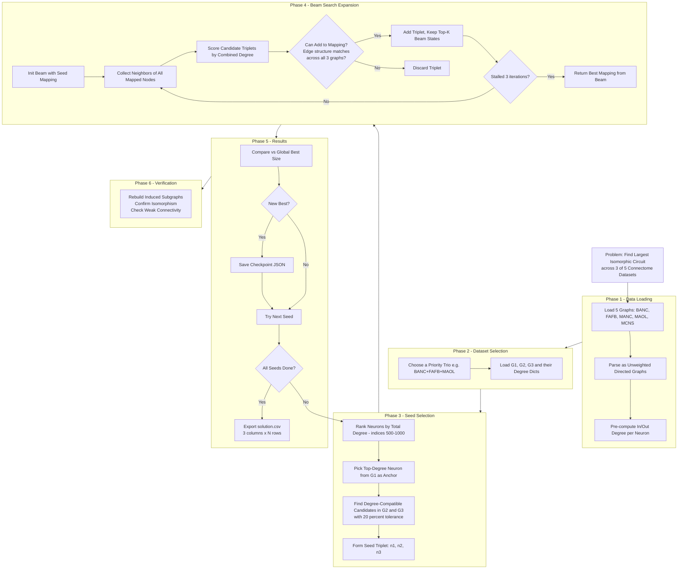

# FLYWIRE CHALLENGE

> [!WARNING]
> *Work in progress:* The final algorithm did not converge on a large-scale isomorphic circuit within the available runtime. The analysis and results presented here are based on a 5-node circuit obtained during an earlier validation run. Given the limited sample size, definitive biological conclusions are constrained and representative only.

## Find largest induced isomorphic subgraph between 3 of the 5 datasets
Induced Isomorphic Subgraph is the set of vertices and edges that form the same structure between the vertices and edges included, they need not form an exact match to the next set in terms of in degree and out degree.

## FINAL METHODOLOGY

### 1) Recieve and Process Data
Download data, recieved as 5 datasets of csv format source_id, dest_id.

Converted data to useable format -> igraph graphs, csv containing neuron data (in-degree, out-degree and id)

Remove autapses (self loops)

Validated Data structure and formatting for future steps

### 2) Dataset Selection and Load
Select 3 datasets to find maximum size induced subgraph for.
Loading their graphs and in/out degree attributes

### 3) Seed Selection
Identified best candidate to start from priority given to high degree targets and ... [TODO]

### 3) 

[TODO] Technical decisions (why igraph? possibility of parallelisation? checkpoint formation?)
