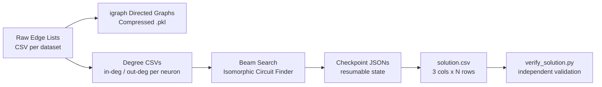
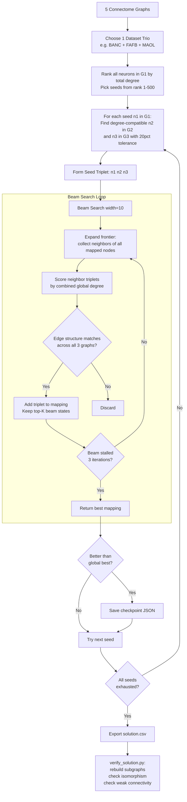
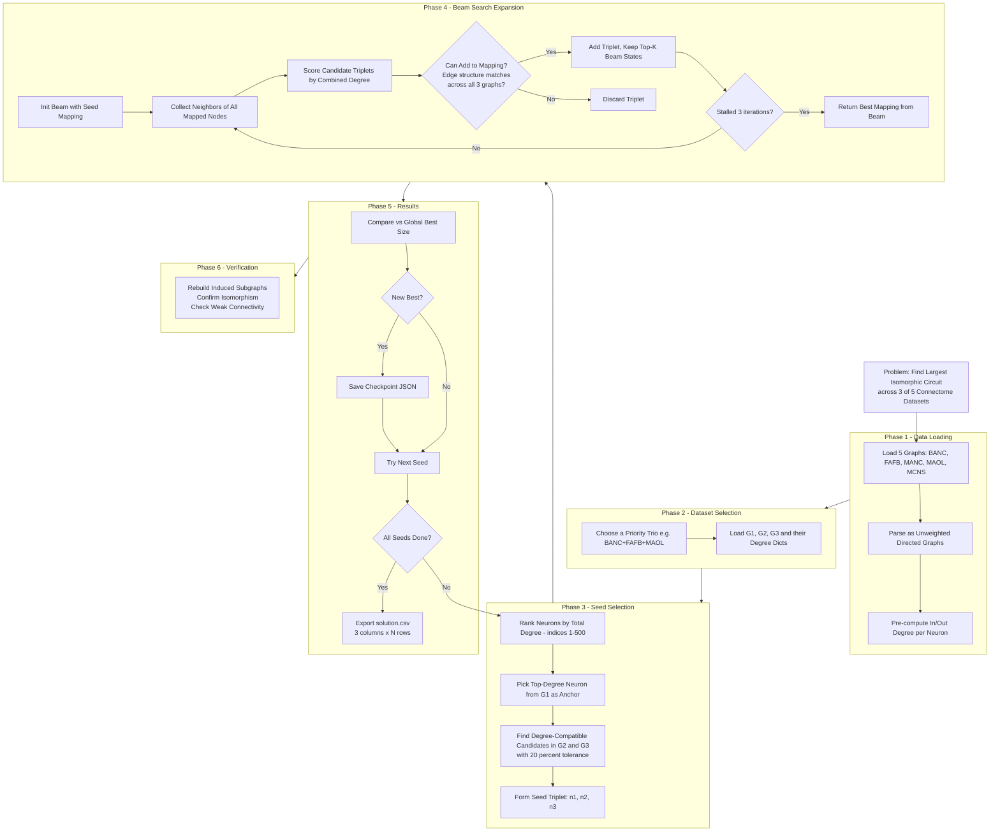
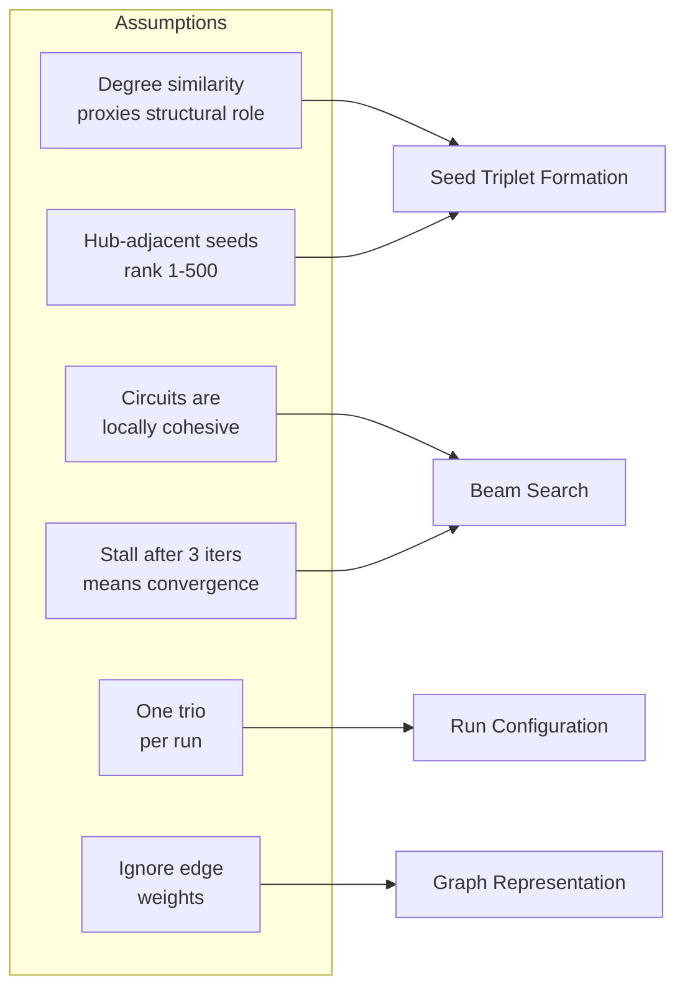
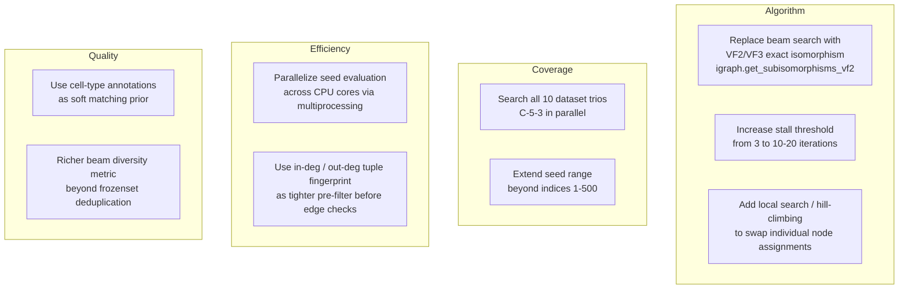

# flywirequal-find-max-isomorphic-subgraph

Find the largest isomorphic neuronal circuit shared across 3 of 5 FlyWire connectome datasets (BANC, FAFB, MANC, MAOL, MCNS).

---

## Technical Stack

| Layer | Tool |
|---|---|
| **Graph engine** | `igraph` (C-backed Python bindings) — directed graph ops, compressed pickle I/O |
| **Data handling** | `pandas` — CSV loading with explicit string dtypes to prevent 64-bit int overflow |
| **Serialization** | Compressed pickle (`.pkl` via `igraph.Read_Picklez`) for graphs; JSON for checkpoints |
| **Language** | Python 3 |
| **Algorithm paradigm** | Heuristic search (Beam Search + greedy expansion) — not exact NP-hard subgraph isomorphism |
| **Storage** | Flat CSV (degrees), JSON (checkpoints), CSV (solution output) |

---

## High-Level Approach

---

## Approach Flow (Detailed Phases)

## Key Design Decisions

| Phase | Key Idea |
|---|---|
| **Seed Selection** | Start from high-degree neurons — structural hubs are more likely to appear across datasets |
| **Degree Tolerance** | ±20% variance allowed to accommodate biological noise in real connectomes |
| **Beam Search** | Tracks K=10 parallel mappings simultaneously to escape greedy dead-ends |
| **Isomorphism Check** | Verifies every pairwise edge direction matches across all 3 graphs before accepting a node |
| **Connectivity** | Final circuit must be weakly connected (beyond pure isomorphism) |

---

## Key Assumptions

1. **Degree as a proxy for structural equivalence** — neurons with similar total degree (±20%) are treated as plausible matches. Assumes hub neurons play equivalent roles across species/datasets.
2. **Hub-adjacent seeds are more productive** — seeds are drawn from rank 1–500, not top-1. The very highest-degree neurons are assumed to be outlier super-hubs unlikely to have exact structural counterparts elsewhere.
3. **Locally connected growth is sufficient** — expansion only considers neighbors of already-mapped nodes. Assumes the target circuit is locally cohesive, not scattered.
4. **Stalling = convergence** — 3 consecutive iterations with no beam improvement is treated as the search having exhausted useful expansions. May terminate early on sparse graphs.
5. **One trio at a time** — only one dataset combination is actively searched per run (currently BANC+FAFB+MAOL). Other combinations are explored in separate runs.
6. **Edge weights carry no structural information** — synapse counts are discarded; only binary edge presence is used, as required by the challenge.

---

## Solution Strengths vs. Challenge Requirements

### Correctness of Formulation
- **Unweighted directed graphs** — edge weights (synapse counts) are explicitly ignored; only edge existence and direction are used, exactly as required.
- **Strict induced subgraph isomorphism** — `can_add_to_mapping()` checks every pairwise directed edge in both directions before accepting a new node.
- **Directionality preserved** — both `A→B` and `B→A` are checked independently for every pair.
- **Weak connectivity enforced** — `verify_solution.py` explicitly builds the circuit graph and checks it is weakly connected.

### Methodological Rigor
- **Independent verifier** — `verify_solution.py` is a fully separate script that reloads graphs from scratch and re-validates end-to-end, guarding against self-confirming bugs.
- **Biological noise tolerance** — the ±20% degree tolerance is a principled, documented design choice reflecting real connectome variance.
- **No same-region assumption** — neuron matching is purely structural, in line with the explicit challenge clarification.
- **Checkpoint/resume system** — progress is persisted to JSON after every improvement, enabling reproducible restarts.

### Search Quality
- **Beam search over greedy** — K=10 parallel mappings avoids permanent entrapment at locally optimal but globally suboptimal nodes.
- **Hub-first seeding** — biases discovery toward structurally rich, well-connected circuits.
- **Degree-sorted candidate expansion** — neighbor triplets ranked by combined global degree before isomorphism checking.

---

## Things to Make It Better

| Area | Improvement |
|---|---|
| **Algorithm** | Replace heuristic beam search with VF2/VF3 exact subgraph isomorphism (`igraph.get_subisomorphisms_vf2()`) for provably optimal results |
| **Seed strategy** | Try all 10 possible dataset trios C(5,3) — the best circuit may be in a combination not yet searched |
| **Candidate filtering** | Use (in-degree, out-degree) tuple fingerprints as a tighter pre-filter, cutting the 15×15×15 triplet space significantly |
| **Stall detection** | Increase stall threshold from 3 to 10–20, or add backtracking to recover from dead-ends |
| **Beam diversity** | Current deduplication by `frozenset(mapping.values())` collapses different paths — use a richer diversity metric |
| **Parallelism** | Seed evaluation is embarrassingly parallel — distribute across CPU cores with `multiprocessing.Pool` |
| **Biological priors** | Incorporate cell-type annotations as a soft filter — same cell class neurons are more likely true correspondences |
| **Post-processing** | After finding best mapping, attempt per-node swaps (local search) to escape the first locally optimal assignment |
