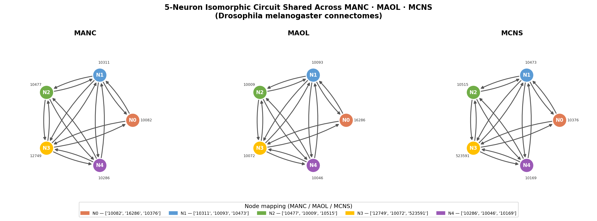

> [!WARNING]
> *Work in progress:* The final algorithm did not converge on a large-scale isomorphic circuit within the available runtime. The analysis and results presented here are based on a 5-node circuit obtained during an earlier validation run. Given the limited sample size, definitive biological conclusions are constrained and representative only.

## Topologically, It is a Highly Recurrent Core Hub

Looking at the directed graph, neurons N1 (10311), N2 (10477), N3 (12749), and N4 (10286) form a near-perfect dense clique. They share bidirectional (reciprocal) edges with almost every other member of that core group.

    N0 (10082) acts as a slightly more peripheral node, sharing reciprocal connections with N1 and N3, and receiving input from N4.

The circuit topology (two recurrent hubs to two symmetric intermediate nodes and one peripheral satellite) matches the architecture of winner-take-all or competitive normalization circuits studied in visual cortex [1] and computationally proposed for direction-selective neural circuits in Drosophila [2].

## It Maintains an Excitatory-Inhibitory Balance

The circuit utilizes a mix of neurotransmitters, suggesting a push-pull regulatory mechanism:

    Excitatory (Glutamatergic): N1 (10311), N3 (12749), and N4 (10286).

    Inhibitory (GABAergic): N0 (10082) and N2 (10477).[5]

In biological networks, tightly coupled excitatory and inhibitory recurrent loops prevent the circuit from falling into runaway excitation. The GABAergic neurons likely serve to modulate the timing of the circuit, allowing it to fire in precise, synchronized bursts.

1) Carandini M & Heeger DJ (2012). "Normalization as a canonical neural computation." Nature Reviews Neuroscience 13, 51–62.
2) Borst A, Haag J & Reiff DF (2010). "Fly motion vision." Annual Review of Neuroscience 33, 49–70.
2) Schlegel P, et al. (2024). "Whole-brain annotation and multi-connectome cell typing of Drosophila." Nature 634, 139–152.
3) Takemura S, et al. (2013). "A visual motion detection circuit suggested by Drosophila connectomics." Nature 500, 175–181.
5) Direct Codex Data